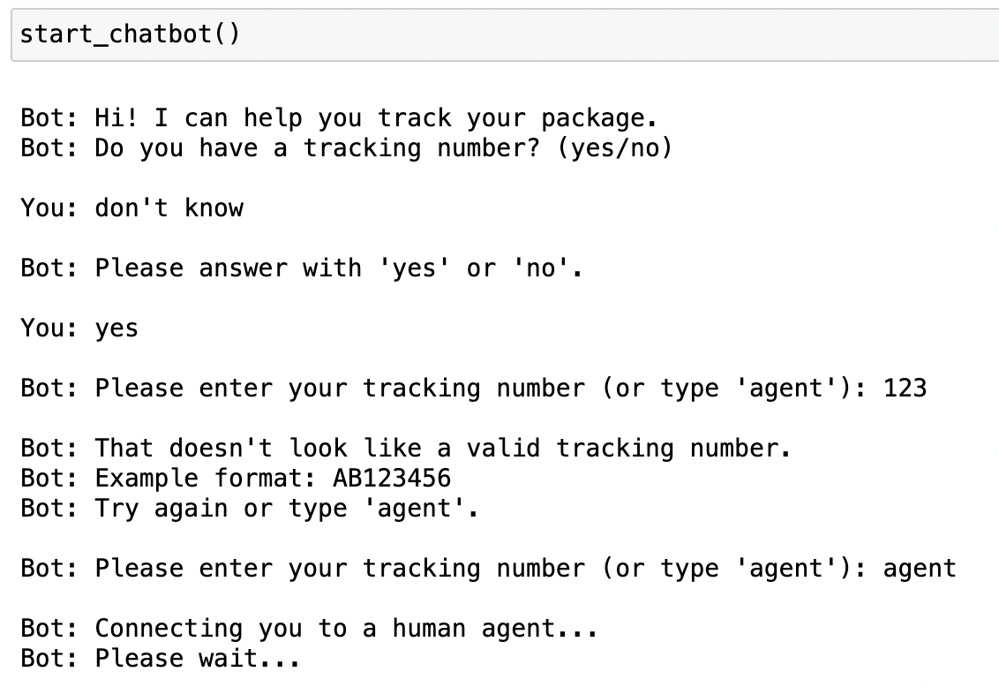
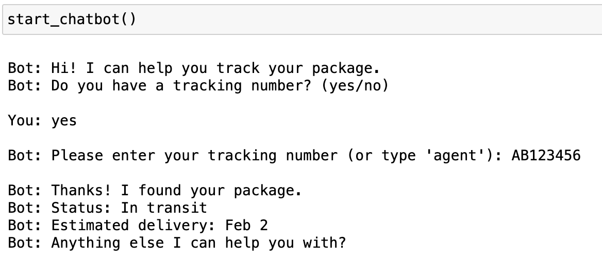
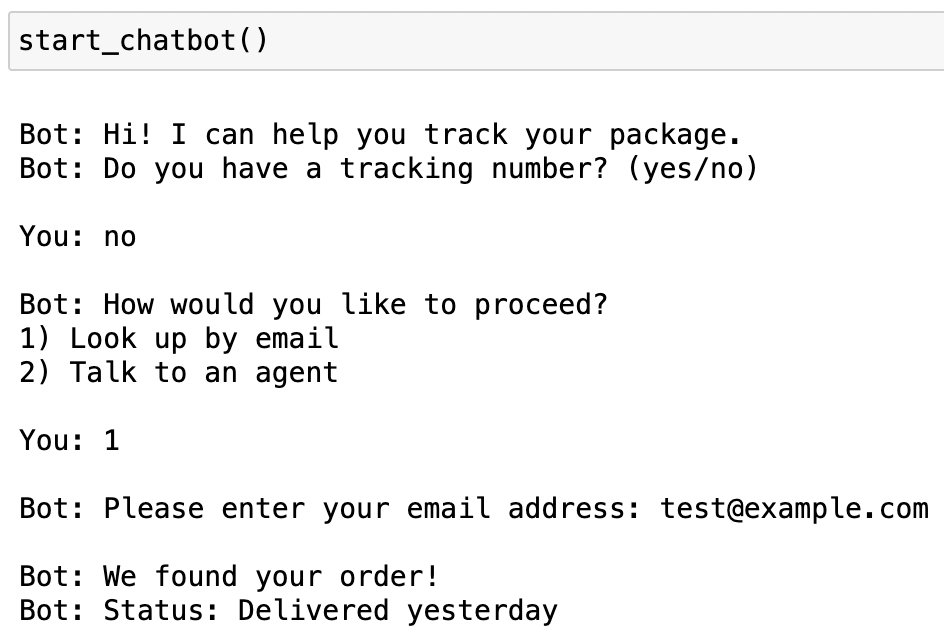

# Customer Service Chatbot – Package Tracking

## Overview
This project implements a simplified customer service chatbot that helps users track a lost package.  
The chatbot is designed to demonstrate conversation flow design, error handling, and clean technical implementation for customer engagement systems.

The chatbot supports:
- Tracking a package using a tracking number
- Looking up an order by email if a tracking number is unavailable
- Graceful handling of unexpected user inputs
- Escalation to a human agent when automation is insufficient

---

## Approach & Design
The chatbot is implemented using a **decision-tree conversation model**  

Key design choices:
- Modular functions for each conversation step
- Explicit input validation and retry paths
- Clear separation between happy paths and error handling
- Human agent escalation available

A visual flowchart of the conversation design is included in the `flowcharts/` directory.

---

## Setup & Installation

### Prerequisites
- Python 3.8+
- Jupyter Notebook

### Running the Chatbot
1. Clone the repository:
   ```bash
   git clone https://github.com/your-username/egain-chatbot-package-tracking.git
   cd egain-chatbot-package-tracking
2.Open the Jupyter notebook:

jupyter notebook chatbot_package_tracking.ipynb

3.Run all cells in order.

4.Execute the final cell to start the chatbot and interact via the command line.

## Error Handling
The chatbot handels:
- Invalid tracking numbers
- Invalid email addresses
- Unexpected menu selections
- Incorrect yes/no inputs

## Example Interactions

**Invalid Tracking Number (Error Handling)**  


**Successful Tracking Number Lookup**  


**Successful Email Lookup**  

